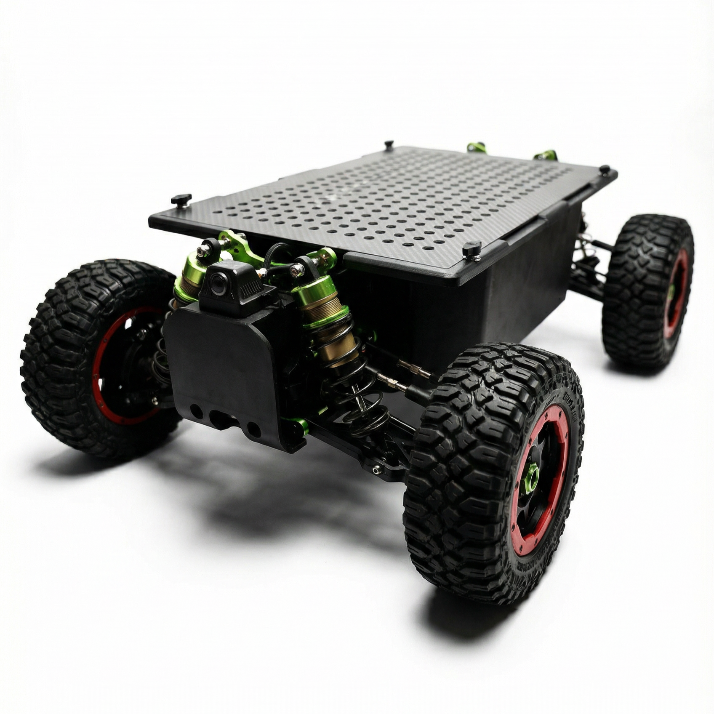

# 🐊 LIZARD MK-2 Unmanned Ground Vehicle (UGV)

*Figure: LIZARD MK-2 Small Multi-purpose Unmanned Ground Vehicle*

## 📖 Introduction

Compact UGV with perforated deck for field research, patrol, exploration, filming, and DIY fun. 80 km/h, 20 kg payload, 4G control, Android app. Plug-and-play modules for sensors, cameras, tools, and more. Available in Tactical and Civilian versions.

## ✨ Key Features

- **Tactical Version** – Urban operations, anti-armor defense, reconnaissance, high-risk field interventions, and frontline security.
- **Civilian Version** – Field research, light-duty patrol, outdoor exploration, professional filming, and customizable DIY entertainment.
- 80 km/h top speed (unloaded) / 30 km/h (full load)
- 20 kg payload + 100 kg towing capacity
- 4G remote control with intuitive Android app
- Plug-and-play modular support: sensors, cameras, lighting, environmental monitors, tool carriers, and functional extensions (Civilian version).

## 📊 Technical Specifications

| Parameter             | Specification                                    |
|-----------------------|--------------------------------------------------|
| Vehicle Type          | Small multi-purpose unmanned ground vehicle      |
| Dimensions            | 760 mm × 510 mm × 320 mm                         |
| Weight (without battery) | ≤15 kg                                         |
| Payload Capacity      | 20 kg                                            |
| Towing Capacity       | 100 kg                                           |
| Max Climbing Angle    | 35°                                              |
| Max Speed (unloaded)  | 80 km/h                                          |
| Max Speed (full load) | 30 km/h                                          |
| Max Range (unloaded)  | 60 km                                            |
| Max Range (full load) | 30 km                                            |
| Communication Mode    | 4G (user‑provided SIM card)                      |
| Battery System        | 21700 Li‑ion cells; 2 × 4S2P or 2 × 3S2P (Standard Version) |
| Battery Connector     | XT60 female (batteries not included)             |
| Motor                 | 650kV sensored brushless motor                   |
| **Application Scenarios** |                                              |
| - Tactical Version    | Urban operations, anti-armor defense, reconnaissance, high-risk field interventions, frontline security |
| - Civilian Version    | Field research, light patrol, outdoor exploration, professional filming, DIY fun, environmental monitoring |

### Video Demo

<video src="demo/demo.mp4" controls width="600"></video>

*Click play to watch the demonstration video.*

## 🤝 Partnership Opportunities

We are actively seeking a wide range of partnerships, including but not limited to research institutions, defense contractors, robotics integrators, filming studios, and DIY communities. Whether you are interested in customizing the platform for a specific application, co-developing new modules, or deploying the LIZARD MK-2 in real-world scenarios, we welcome you to reach out. For collaboration inquiries, please contact us.

## 🚁 Extended Offering: Long-Endurance UAV – Tactical & Civilian

Beyond the LIZARD MK-2 UGV, we develop high-performance long-endurance unmanned aerial vehicles (UAVs) in both **Tactical** and **Civilian** variants. Our Tactical UAVs are designed for defense, surveillance, reconnaissance, and border security missions, featuring encrypted data links, jamming resistance, and extended BVLOS capability. The Civilian versions excel in mapping, agriculture, search & rescue, infrastructure inspection, and professional aerial filming.

Whether you need a rugged military-grade drone or a versatile commercial platform – or an integrated air‑ground solution – we have the expertise to support your mission.

## 📅 Upcoming Event – Japan Drone 2026

We will be visiting **Japan Drone 2026** in Tokyo from **June 3–5, 2026**. If you are attending the show and would like to explore potential collaboration face-to-face, please reach out in advance to schedule a meeting. Let's discuss how our UGV, UAV (tactical or civilian), or combined robotics systems can benefit your projects.

## 🏢 About Us

**ADTG Group**

Our group comprises:

- **Sino-Europa Industrial Science Research Institute**
- **Nanjing Guxuan Technology Co., Ltd.**
- **Astute Agri Systems, Inc.**

Together, we integrate research, development, and manufacturing capabilities to deliver advanced unmanned systems for global partners.
